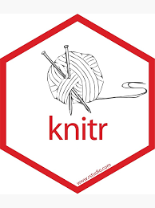
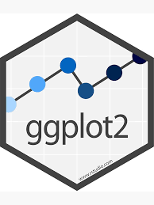
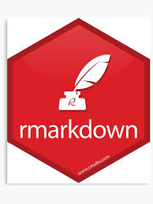

<style> #you can specify any columns, it does not have to be column-left 
.column-left{float: left; width: 33%; text-align: left;}
.column-right{float: right;width: 33%;text-align: right}
.column-center{display: inline-block;width: 33%;text-align: center;}
  body{text-align: justify;}
</style>

```{r setup, include=FALSE}
knitr::opts_chunk$set(
  results = 'asis',
  echo = FALSE,
  warning = FALSE,
  message = FALSE,
  fig.align = 'center'
)

#Load libraries
library(tidyverse)
library(gapminder)
library(kableExtra)
library(imager)
```


# Introduction
My name is *Gilbert Permalloo*. I am a Research Project Officer and I am presently working on roots architecture and rhizosphere of wheat. I worked in sugarcane agronomy for about 24 years and I was doing a little bit of basic programming in Fortran 77 and GWBasic about 30 years ago. Most of my data manipulation and visualisation are done in Excel. I could not write any code in R before I joined Data School and I was spending lots of time working with data in spreadsheets. On the otherhand, I am amazed to witness every day the marvel that R can do with data manipulation and visualisation.

# My Project
The aim of this project is to investigate the use of portable X-Ray fluorescense spectrocopy (pXRF) as a rapid method to quantify the amount of phosphorus accumulated in straw and grains (Figure 1 shows pXRF used). About 200 grab samples were taken from one of three trials at 0kg and 30kg of phosphorus per hectare as treatments for this study. The straw and grains were ground (Figure 2), and scanned by the pXRF. Two large datasets were generated by the pXRF; the chemistry dataset is composed of a wide range of chemical elemental composition quantified in ppm, whereas the beamspectra, are spectral values from three X-ray beams.
R has been used to clean, tidy and re-organised the data, as well as for graphical visualisation.
Data for phosphorus have been extracted from the large pXRF generated-dataset and merged with a dataframe that contains unique identification numbers (SampleID) that links the data to the sample source (STEM_ID) and other spreadsheets that contain agronomical data for each sample. Table 1 shows the data that have been selected and filtered from other spreadsheets using R scripts.

## Preliminary results
Figures 3 and 4 show a relatively higher amount of phosphorus detected in the grains as compared to the straw. A slightly higher correlation between straw and grains for phosphorus assimilated under the 30kg/ha P treatment in comparison to the 0kg/ha P. Figure 2 shows that the level of P detected in the straw does not correlate with the grain yield. However, the amount of phosphorus detected in grains for the two treatments correlate differently to yield. Grains produced under the low treatment  tend to show a slight positive correlation to yield as opposed to the 30kg/ha treatment, which has a negative correlation to yield.

<!-- # To get tables formatting correctly, use `knitr::kable` to convert the table to html format. If
# you also want to have alternate row highlighting, pass the result to `kable_styling('striped')` 
# from the `kableExtra` package.

This section will demonstrate the different visuals you might want use to show off your 
project. Don't feel the need to go overboard, this is supposed to give a taste of the work you are
doing rather than being a publication ready document. -->

<div class = "row">

<div class="col-md-6">

```{r, fig.cap="pXRF instrument used to quantify amount of phosphorus in straw and grains", out.width="120px"}
knitr::include_graphics("resources/img/pXRF.gif")
```

</div>

<div class="col-md-6">

```{r, fig.cap="Ground grains, empty cup and ground grains packed in cup", out.width="200px"}
knitr::include_graphics("resources/img/Ground_grain_cups.gif")
```


</div>

```{r mytable, out.width='80%', echo = T}

data_straw_grain <- read_csv("clean_data/straw_grain_p.csv")

data_straw_grain_p <- data_straw_grain %>% 
  select(STEM_ID, GENOTYPE, straw_pconc, PAP.x, grain_pconc, yield) %>%
  rename(`P in straw` = straw_pconc,`P in grain` = grain_pconc, `P level (kg/ha)` = PAP.x, `yield (kg)` = yield)

knitr::kable(head(data_straw_grain_p, n = 5),
             format = "html",
             caption = "Amount of phosphorus (ppm) detected in straw and grains for each genotype") %>% 
  kable_styling("striped")

```


**Plots from R**
<div class = "row">

<div class="col-md-6">
```{r strawgrain-plot, out.width='100%', fig.align='center', fig.height= 4, fig.width=6, fig.cap="Amount of phosphorus (ppm) in straw vs in grains", echo = TRUE}
straw_grain_p <- read_csv("clean_data/straw_grain_p.csv")

straw_grain <- ggplot(data = straw_grain_p,
                      mapping = aes(x = grain_pconc,
                                    y = straw_pconc,
                                    colour = PAP.x
                                    )) +
  geom_point(alpha = 0.2) +
  geom_smooth(method = "lm", size = 0.5, se = FALSE)

straw_grain +
  labs(x = "Grains",
       y = "Straw") +
  geom_point(alpha = 0.2)

```
</div>

<div class="col-md-6">
```{r Pyield-plot, out.width='100%', fig.align='center', fig.height= 4, fig.width=6, fig.cap="Amount of phosphorus in straw and grains vs grain yield", echo= TRUE}
good_data <- read_csv("clean_data/good_data_york_pxrf.csv")  

yield_Pconc <- ggplot(data = good_data,
                        mapping = aes(x = yield,
                                      y = `P Concentration`,
                                      colour = PAP,
                                      shape = SUBSAMPLE
                        )) +
  geom_point() +
  geom_smooth(method = "lm", size = 0.5, se = FALSE)

yield_Pconc +
  labs(x = "Yield (Kg)",
       y = "P Concentration (ppm)") +
  geom_point()

```
</div>
</div>

<!-- # Your figure and table captions are automatically numbered and can be referenced in the text
# if needed: see eg. Table \@ref(tab:mytable) and Figure \@ref(fig:standard-plot)-->


# My Digital Toolbox

For this project, I have been using the R version `r getRversion()` and the digital tools _tidyverse, ggplot2, kableExtra, imager, data.table, readxl, lubridate_

<!-- # What digital tools have you been using in your project? Which ones have you learned since starting Data School?
# You can use all the usual R markdown features in writing a project summary, including lists:
# * R - dplyr, ggplot2, ...
# * library(data.table)
# * library(tidyverse)
# * library(readxl)
# * library(lubridate)
--> 


## Favourite tools

<div class = "row">
<div class="col-md-1">
{width=120px}
</div>
<div class="col-md-1">
{width=90px}
</div>
<div class="col-md-1">
{width=90px}
</div>
<div class="col-md-1">
{width=90px}
</div>
</div>

<!-- # {.pull-right width=100px}
-->


# My time went ...

Most of my time went into tidying up and cleaning the data. Then I realised how crucial it is to understand the "how" and "what" data to be collected, and the structure and formatting - not to forget how and where they are stored.
I wrote codes in R to resolve the issues and bring them together in one clean data set that can be reused by anyone at anytime in the future.

# Next steps

I will continue to use R for data manipulation so that I improve my skills and build up my trust in good reusable data. I am looking forward to use R from preparing trial design, data manipulation, visualisation, analysing and to publishing.

# My Data School Experience
My Data School experience has been a challenging, exciting and most of all very enriching. One of the challenges was to make a mind-shift to learn and adopt a new platform to manipulate data safely, explicitly and with a higher level of repeatability, that is far away from a risky and bad habit of doing all the data manipulation in spreadsheets. I really enjoyed everything but my favourite one is the vast options available to plot all sorts of graphs to convey the most important information. My team members are very excited to embark on such marvellous journey of R learning through Data School in the future.
<!--This poster is mostly about your synthesis project. However we would also like to hear about other
parts of your Data School experience. What aspects of the program did you really enjoy? How have you
been applying the skills you have learned in your daily work? Have you been able to transfer this 
knowledge to your team members? Concrete examples demonstrating this would be useful here
(meetings/talks/collaborations/new roles). Any descriptions of the personal impact the program has 
had are welcome here as well-->

# A huge THANK YOU to ...
Kerensa McElroy, Stephen Pearce, Alex Whan, Neil Francis, Peter Watkins, Aswin Singaram, Natarajan, Emmett Leyne, Anton Wasson and other helpers who have dedicated their time to teach us R, and Nat Lui for ensuring everyone is on board. Also to Jen Taylor, as a driver to make the learning of R possible through FOCUS Data School. Last but not least, special  thanks to my "Root" team who have made the time available for me to commit to the learning for 10 weeks.
